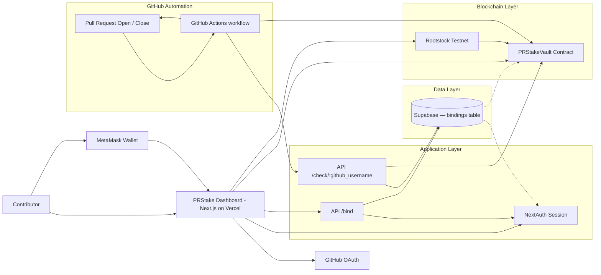
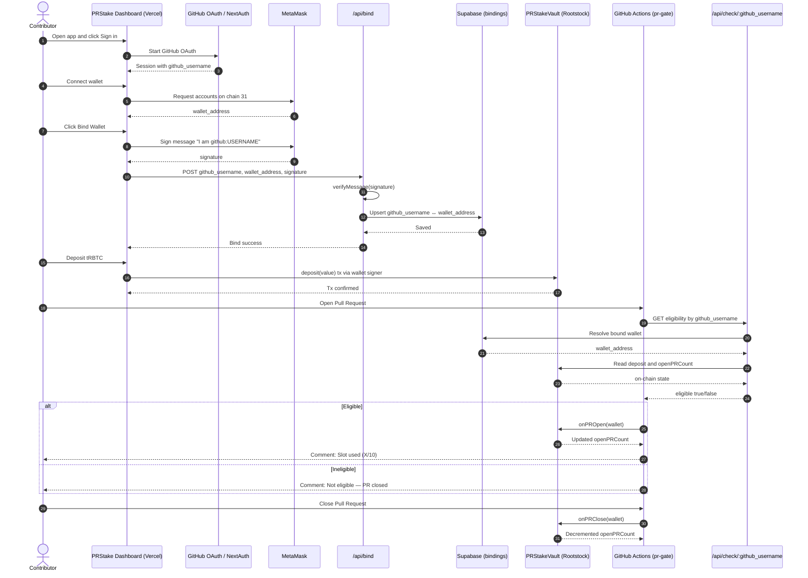

# PRStake

> A crypto-economic pull request gating system for open-source repositories.

[](https://rootstock-testnet.blockscout.com/address/0x3463253c56C5aa979B6eCB9c3aFBad603D51AD84?tab=index)
[](https://nextjs.org)
[](https://soliditylang.org)
[](LICENSE)

---

## The Problem

Open-source contribution lacks accountability. Contributors can open multiple pull requests without commitment, and maintainers have no lightweight way to regulate quality without significant manual effort. The result: PR queues clogged with abandoned work, frustrated maintainers, and reduced trust in the contribution pipeline.

## The Solution

PRStake adds a minimal staking layer to the GitHub contribution workflow. Contributors stake once to unlock PR slots. Responsible behavior is rewarded with a full deposit return. Irresponsible behavior — leaving PRs open, spamming — is naturally rate-limited through liquidity lock rather than punitive slashing.

**The key insight:** staking acts as both commitment signal and rate-limiter simultaneously.

---

## Links

| Resource | URL |
|---|---|
| Architecture | [architecture.md](architecture.md) |
| Demo | [youtube.com/watch?v=XkVcxlGLISo](https://www.youtube.com/watch?v=XkVcxlGLISo) |
| Contract Explorer | [Rootstock Testnet](https://rootstock-testnet.blockscout.com/address/0x3463253c56C5aa979B6eCB9c3aFBad603D51AD84?tab=index) |

---

## How It Works

```
1. Log in with GitHub
2. Connect wallet & sign binding message
3. Deposit tRBTC once
4. Deposit unlocks up to 10 concurrent PR slots
5. Each open PR consumes one slot
6. Closing or merging a PR frees one slot
7. When all PRs are closed, claim your full deposit back
```

No slashing. No penalties. Only time-locking as a natural deterrent.

---

## Architecture

### System Overview



### Contributor Flow (Sequence Diagram)



---

## Smart Contract

**Main contract:** `contracts/PRStakeVault.sol`  
**Network:** Rootstock Testnet

### Core Methods

| Method | Access | Description |
|---|---|---|
| `deposit()` | Public | Deposit tRBTC to activate PR slots |
| `onPROpen(address wallet)` | Trusted action | Increment open PR count for wallet |
| `onPRClose(address wallet)` | Trusted action | Decrement open PR count for wallet |
| `claimDeposit()` | Public | Reclaim deposit when all PRs are closed |

### Enforcement Rules

- Maximum **10 open PRs** per wallet at any time
- Only the designated `TRUSTED_ACTION_ADDRESS` may call `onPROpen` / `onPRClose`
- `claimDeposit()` is only callable when `openPRCount == 0`

---

## GitHub Action Gate

**Workflow:** `.github/workflows/pr-gate.yml`

- **On PR open:** calls `/api/check/:github_username` — closes the PR automatically if contributor is ineligible
- **On PR close:** decrements the contributor's open slot count on-chain

No maintainer intervention required.

---

## Tech Stack

| Layer | Technology |
|---|---|
| Smart Contract | Solidity + Hardhat (Rootstock Testnet) |
| Frontend | Next.js 14 (App Router) |
| Auth | NextAuth.js (GitHub OAuth) |
| Database | Supabase |
| CI/CD | GitHub Actions |

---

## Local Development

### Prerequisites

- Node.js 18+
- A Rootstock-compatible wallet (MetaMask with chain 31)

### Setup

```bash
# Install dependencies
npm install

# Compile and deploy contracts locally
npm run hardhat:compile
npm run hardhat:deploy

# Start the development server
npm run dev
```

Open [http://localhost:3000](http://localhost:3000).

---

## Database Setup (Supabase)

This project requires a `public.bindings` table in Supabase.

### Recommended (CLI)

```bash
npx supabase login
npx supabase link --project-ref <your-project-ref>
npx supabase db push
```

Migration file: `supabase/migrations/202604010001_create_bindings.sql`

### Manual SQL Fallback

```sql
create table if not exists public.bindings (
  wallet_address  text primary key,
  github_username text unique not null,
  signature       text not null,
  created_at      timestamptz default now(),
  updated_at      timestamptz default now()
);

create index if not exists idx_bindings_github_username
  on public.bindings (github_username);
```

---

## Environment Variables

Copy `.env.example` to `.env.local` and fill in the values below.

### Application / API

| Variable | Description |
|---|---|
| `SUPABASE_URL` | Supabase project URL |
| `SUPABASE_SERVICE_ROLE_KEY` | Supabase service role key (server-side only) |
| `RPC_URL` | Rootstock RPC endpoint |
| `VAULT_ADDRESS` | Deployed `PRStakeVault` contract address |
| `GITHUB_CLIENT_ID` | GitHub OAuth app client ID |
| `GITHUB_CLIENT_SECRET` | GitHub OAuth app client secret |
| `NEXTAUTH_SECRET` | Random secret for NextAuth.js session encryption |
| `NEXTAUTH_URL` | Canonical URL of your deployment |
| `NEXT_PUBLIC_VAULT_ADDRESS` | Vault address exposed to the browser |
| `NEXT_PUBLIC_RPC_URL` | RPC URL exposed to the browser |
| `NEXT_PUBLIC_WALLETCONNECT_PROJECT_ID` | WalletConnect project ID |

### Deployment / Automation

| Variable | Description |
|---|---|
| `PRIVATE_KEY` | Wallet private key for contract deployment |
| `TRUSTED_ACTION_ADDRESS` | Address authorised to call PR open/close hooks (optional) |
| `DASHBOARD_URL` | Public URL of the dashboard, used in PR comments |

---

## Design Philosophy

PRStake deliberately avoids slashing. Funds are never taken from contributors — they are only time-locked until outstanding PRs are resolved. This makes the system:

- **Beginner-friendly** — contributors are not penalised for inexperience
- **Fair** — bad actors are slowed down, not financially punished
- **Self-regulating** — economic friction replaces manual moderation
- **Extensible** — the staking primitive naturally supports future features such as on-chain reputation scores, contributor rewards, and DAO-based governance

---
 
## Future Scope
 
PRStake is intentionally minimal at its core — but the staking primitive opens the door to a richer ecosystem:
 
| Area | Description |
|---|---|
| **On-chain Reputation** | Accumulate a non-transferable score based on merge rate, PR quality, and slot discipline — visible to any repo or DAO |
| **Tiered Slots** | Higher deposits unlock more concurrent PR slots, allowing prolific contributors to scale without friction |
| **Contributor Rewards** | Maintainers or protocols can top up a reward pool; merged PRs trigger proportional payouts from the vault |
| **DAO Governance** | Governance token holders vote on stake thresholds, slot limits, and trusted action addresses per repository |
| **Cross-repo Identity** | A single staked identity works across multiple repositories without re-depositing |
| **Slash Conditions (opt-in)** | For high-security or bounty repos, maintainers can enable configurable slashing on closed-without-merge PRs |
| **Reputation-gated Reviews** | Extend the gating model to code reviews — require reviewers to stake before their approvals are counted |
| **Analytics Dashboard** | Public contributor health metrics: slot utilisation, merge rate, average PR lifetime, on-chain activity |
 
The current architecture — Supabase bindings, a single vault contract, and a GitHub Actions hook — is designed to support all of the above without a rewrite.

---

## Contributing

PRStake is itself an open-source project. Contributions are welcome — and yes, they are gated by PRStake.

---

## License

MIT
