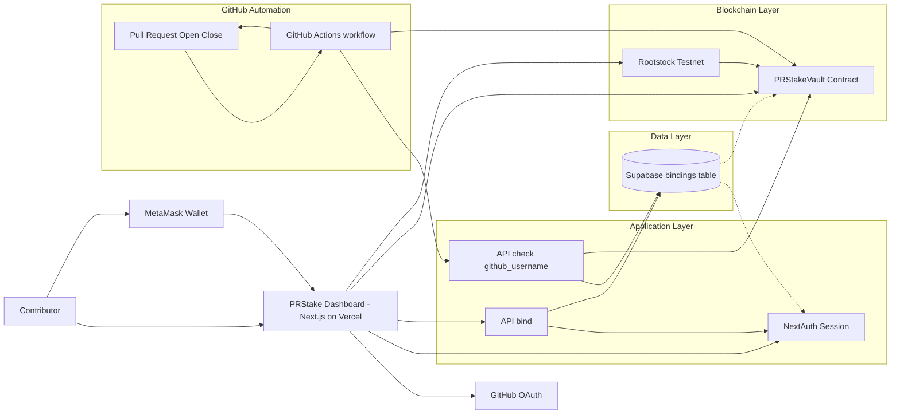
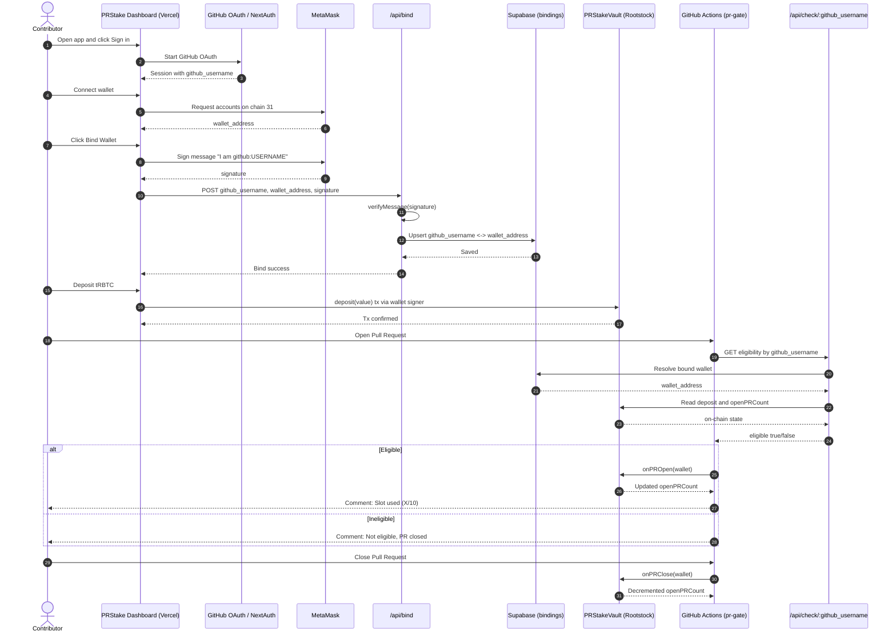

```mermaid
flowchart LR
U[Contributor]
GH[GitHub OAuth]
MM[MetaMask Wallet]
UI[PRStake Dashboard - Next.js on Vercel]

subgraph APP[Application Layer]
AUTH[NextAuth Session]
BINDAPI[API bind]
CHECKAPI[API check github_username]
end

subgraph DATA[Data Layer]
SB[(Supabase bindings table)]
end

subgraph CHAIN[Blockchain Layer]
RS[Rootstock Testnet]
VAULT[PRStakeVault Contract]
end

subgraph CI[GitHub Automation]
PR[Pull Request Open Close]
ACT[GitHub Actions workflow]
end

U --> UI
UI --> GH
UI --> AUTH
U --> MM
MM --> UI

UI --> BINDAPI
BINDAPI --> AUTH
BINDAPI --> SB

UI --> VAULT
UI --> RS
RS --> VAULT

PR --> ACT
ACT --> CHECKAPI
CHECKAPI --> SB
CHECKAPI --> VAULT

ACT --> VAULT
ACT --> PR

SB -.-> AUTH
SB -.-> VAULT
```

```mermaid
sequenceDiagram
	autonumber
	actor C as Contributor
	participant D as PRStake Dashboard (Vercel)
	participant GH as GitHub OAuth / NextAuth
	participant MM as MetaMask
	participant BA as /api/bind
	participant SU as Supabase (bindings)
	participant VA as PRStakeVault (Rootstock)
	participant GA as GitHub Actions (pr-gate)
	participant CA as /api/check/:github_username

	C->>D: Open app and click Sign in
	D->>GH: Start GitHub OAuth
	GH-->>D: Session with github_username

	C->>D: Connect wallet
	D->>MM: Request accounts on chain 31
	MM-->>D: wallet_address

	C->>D: Click Bind Wallet
	D->>MM: Sign message "I am github:USERNAME"
	MM-->>D: signature
	D->>BA: POST github_username, wallet_address, signature
	BA->>BA: verifyMessage(signature)
	BA->>SU: Upsert github_username <-> wallet_address
	SU-->>BA: Saved
	BA-->>D: Bind success

	C->>D: Deposit tRBTC
	D->>VA: deposit(value) tx via wallet signer
	VA-->>D: Tx confirmed

	C->>GA: Open Pull Request
	GA->>CA: GET eligibility by github_username
	CA->>SU: Resolve bound wallet
	SU-->>CA: wallet_address
	CA->>VA: Read deposit and openPRCount
	VA-->>CA: on-chain state
	CA-->>GA: eligible true/false

	alt Eligible
		GA->>VA: onPROpen(wallet)
		VA-->>GA: Updated openPRCount
		GA-->>C: Comment: Slot used (X/10)
	else Ineligible
		GA-->>C: Comment: Not eligible, PR closed
	end

	C->>GA: Close Pull Request
	GA->>VA: onPRClose(wallet)
	VA-->>GA: Decremented openPRCount
```